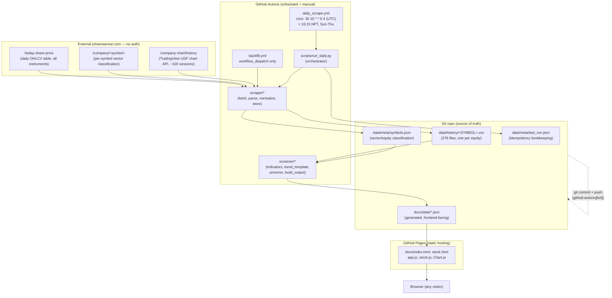
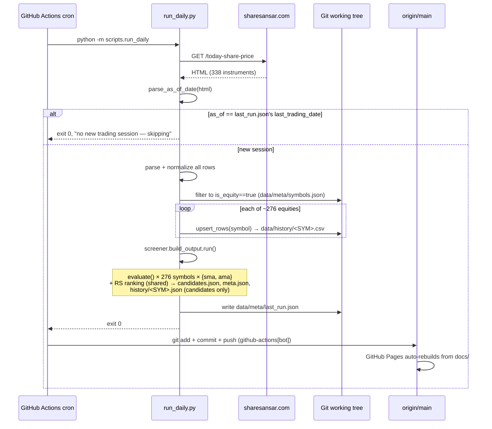

# Technical Design Document — NEPSE Stage 2 Screener

**Repo:** https://github.com/Sujangyawali/nepse-stage2-screener
**Live site:** https://sujangyawali.github.io/nepse-stage2-screener/
**Status:** Live, automated, in production since 2026-07-24.

---

## 1. Purpose & Scope

A stock screener for the Nepal Stock Exchange (NEPSE) that flags equities entering
**Stage 2** of Stan Weinstein's market-cycle model, using Mark Minervini's 8-point Trend
Template from *Trade Like a Stock Market Wizard*, evaluated two ways: against classic
50/150/200-day **SMA**s, and independently against **Kaufman's Adaptive Moving Average
(AMA)**.

**Non-goals:**
- Not a broker, not a trade execution system, not investment advice (see [§8](#8-known-limitations)).
- Not a real-time system — it evaluates once per NEPSE trading session, after close.
- Not covering non-equity instruments (mutual funds, debentures, bonds, promoter/preference
  shares are deliberately excluded — see [§6.3](#63-equity-classification)).

**Why it exists:** NEPSE has no official public API. Every data need here is met by
reverse-engineering public, unauthenticated endpoints on sharesansar.com — there is no
API key, no login, no paid data feed anywhere in this system.

---

## 2. System Architecture



**Key architectural decision:** there is no backend server, no database, and no cloud
hosting bill. GitHub Actions *is* the compute; the git repository *is* the database
(CSV + JSON, plain files, fully diffable and auditable); GitHub Pages *is* the web server.
Everything is free at this scale and requires no credentials to operate.

---

## 3. Component Breakdown

| Path | Responsibility |
|---|---|
| `scraper/config.py` | URLs, timeouts, headers, timezone (`Asia/Kathmandu`), sector-exclusion list, file paths |
| `scraper/fetch_today.py` | GET `/today-share-price`, retry with backoff, raise on malformed response |
| `scraper/parse.py` | BeautifulSoup extraction of the table into raw dict rows + the "as of" trading date |
| `scraper/normalize.py` | Strip thousands separators, coerce types, uppercase symbols, `"-"` → `NaN` |
| `scraper/sector_filter.py` | Per-symbol GET of `/company/<symbol>`, extracts `#sector`, classifies equity vs. excluded, persists `data/meta/symbols.json` |
| `scraper/storage.py` | Idempotent per-symbol CSV upsert (same-day reruns replace, not duplicate); `InvalidSymbolError` guard |
| `scraper/fetch_backfill.py` | Calls the TradingView UDF chart endpoint to seed ~320 sessions of history per symbol |
| `screener/indicators.py` | `sma()`, `kama()`, `moving_average()` dispatcher, `is_trending_up()`, `week52_high_low()` |
| `screener/trend_template.py` | `evaluate(df, method="sma"\|"ama")` — the 8-criterion scorecard, generic over which MA function computes ma50/150/200 |
| `screener/universe.py` | Cross-sectional Relative Strength percentile ranking (method-agnostic — price-return based) |
| `screener/build_output.py` | Orchestrates a full run: loads history, evaluates both methods independently, writes `docs/data/*.json` |
| `scripts/run_daily.py` | Single entrypoint for CI and local dev: scrape → filter to equities → store → screen → publish. Distinguishes "no new session" (clean no-op) from real failure (non-zero exit) |
| `docs/index.html` + `assets/js/app.js` | Candidate list dashboard, SMA/AMA tabs, client-side sortable table |
| `docs/stock.html` + `assets/js/stock.js` | Per-stock detail: Chart.js price+MA chart, 8-criterion scorecard, tab-switchable |
| `.github/workflows/daily_scrape.yml` | Scheduled automation — the only thing that runs unattended |
| `.github/workflows/backfill.yml` | Manual-only: re-run historical backfill and/or refresh sector classification |

---

## 4. Daily Run — Sequence Diagram



**Failure semantics (deliberate design choice):** a day with no new trading session and a
day with a genuine scrape/parse crash must look *different* in the Actions log. Relying on
"no git diff → nothing to worry about" would silently swallow real breakage on a day that
coincidentally produces no new row. `run_daily.py` raises on any scrape/parse/screen error
(non-zero exit, red ✗ in Actions) and only exits 0 quietly for the recognized
already-processed-this-session case.

---

## 5. Data Model

### 5.1 `data/history/<SYMBOL>.csv` (source of truth, one file per equity)

```
date,open,high,low,close,volume,source
2025-02-27,498.7,518.0,498.0,501.8,123140.0,backfill_api
...
2026-07-23,546.0,550.0,545.0,550.0,40281.0,daily_scrape
```
`source` tracks provenance (`backfill_api` vs `daily_scrape`) since the two pipelines hit
different sharesansar endpoints and could theoretically disagree on precision. Upsert is
by `date`: a rerun replaces that day's row rather than duplicating it.

### 5.2 `data/meta/symbols.json`

```json
{ "NABIL": { "name": "Nabil Bank Limited", "sector": "Commercial Bank", "is_equity": true },
  "NICD83/84": { "name": "...", "sector": "Corporate Debentures", "is_equity": false } }
```
Built once (or re-run manually via `backfill.yml`) by scraping each symbol's own company
page. The daily pipeline only *reads* this — it never reclassifies on its own.

### 5.3 `docs/data/candidates.json` (generated, frontend-facing)

```json
{
  "generated_at": "2026-07-24T17:16:28+05:45",
  "as_of_trading_date": "2026-07-23",
  "sma": { "universe_size": 276, "candidates_count": 10, "stocks": [ /* full 276, sorted */ ] },
  "ama": { "universe_size": 276, "candidates_count": 6,  "stocks": [ /* independent scoring */ ] }
}
```
Each stock entry: `symbol, name, sector, close, ma50, ma150, ma200, week52_high/low,
pct_above_52w_low, pct_from_52w_high, rs_percentile, criteria{8 booleans}, score, is_candidate,
history_days_available, data_quality{sufficient_history, possible_corporate_action_gap}`.

### 5.4 `docs/data/history/<SYMBOL>.json` (candidates only, ~300 sessions)

One combined series per date with **both** `sma50/150/200` and `ama50/150/200` fields, so
the frontend tab toggle never needs a second fetch.

---

## 6. Screening Logic

### 6.1 The 8 Trend Template criteria (identical set, two lenses)

1. Price above both the 150- and 200-window MA
2. 150-window MA above 200-window MA
3. 200-window MA trending up (vs. ~20 sessions ago)
4. 50-window MA above both 150- and 200-window MA
5. Price above the 50-window MA
6. Price ≥ 25% above the 52-week low
7. Price within 25% of the 52-week high
8. Relative Strength in the top 30% of the scraped universe

`is_candidate` requires **all 8** (`CANDIDATE_SCORE_THRESHOLD = 8`) and
`sufficient_history` (≥ `MIN_HISTORY_SESSIONS = 200` real rows).

### 6.2 SMA vs. AMA — why both exist

| | SMA | AMA (Kaufman's) |
|---|---|---|
| Formula | Fixed-window arithmetic mean | Recursive, adapts smoothing constant to an efficiency ratio (`ER = net change / sum of abs changes` over `er_period=10`) |
| Behavior | Same lag regardless of market character | Fast in efficient trends, slow in chop |
| Parameters used here | window ∈ {50,150,200} | `er_period=10, fast_period=2`, and `slow_period` reused as {50,150,200} so "AMA50/150/200" stay conceptually comparable to their SMA namesakes |
| Independence | `sma` and `ama` blocks in `candidates.json` are scored **completely independently** — a stock can pass one and fail the other (RS ranking is the only shared input, since it's price-return-based, not MA-based) |

Real example on 2026-07-23: **SHIVM** scored 8/8 on AMA (reversal already caught) but 7/8
on SMA (`sma200_trending_up` still false — the slow SMA hadn't caught up yet).

### 6.3 Equity Classification

`EXCLUDED_SECTORS = {Corporate Debentures, Government Bonds, Mutual Fund, Preference Share,
Promoter Share}`. Everything else scraped from `/company/<symbol>`'s sector is screened.
Currently 276 of 338 total scraped symbols are equities.

### 6.4 NEPSE-specific adaptations

- Windows are **trading-session counts**, not calendar days — handles the Sun–Thu week
  without special-casing.
- "52 weeks" = trailing 235 sessions (not 252) to approximate a NEPSE year.
- `possible_corporate_action_gap`: flags (doesn't correct) a single-session move >18%,
  the practical fingerprint of an unadjusted bonus/rights ex-date gap.

---

## 7. External Dependencies (reverse-engineered, undocumented, unauthenticated)

| Endpoint | Purpose | Notes |
|---|---|---|
| `GET /today-share-price` | Daily OHLCV for all ~338 instruments | Server-rendered HTML table, no JS needed |
| `GET /company/<symbol_lower>` | Sector classification | Hidden `<div id="sector">`; also has `#companyid` |
| `GET /company-chart/history?symbol=X&resolution=D&from=0&to=<now>&countback=5000` | Historical daily bars | TradingView UDF-compatible feed. **`countback` is mandatory** — omitting it silently returns `{"s":"no_data"}` regardless of `from`/`to`. Server ignores `from` and just returns everything it has (~320 sessions, back to ~2025-02-27) |

**This is the single biggest architectural risk in the whole system** (see [§9.1](#91-scraper-breakage-is-the-1-risk)):
none of these are documented contracts. sharesansar could change markup, rename fields,
add auth, or rate-limit at any time with zero notice.

---

## 8. Known Limitations

1. **Historical depth is capped at ~320 sessions** (sharesansar's own data starts
   ~2025-02-27). Enough for the 200-session MA requirement, but no multi-year backtesting.
2. **No corporate-action price adjustment.** Bonus/rights issuances cause real, mechanical
   price cliffs that are indistinguishable from a crash in the raw series. Only flagged,
   never corrected.
3. **Relative Strength is universe-relative, not index-relative** — there's no reliable
   scrapeable NEPSE index history yet, so RS ranks each stock against every other scraped
   equity instead of against the NEPSE index.
4. **Sector classification is a point-in-time snapshot.** New IPOs won't appear in
   `data/meta/symbols.json` until `backfill.yml` is manually re-run with
   `refresh_sectors=true` — until then they're silently excluded from screening (a safe
   default, but silent).
5. **AMA parameters (`er_period=10, fast=2`) are a design choice, not a canonical
   standard.** Different parameter choices would produce a different (still defensible)
   candidate list.
6. **Not investment advice.** Mechanical screener over incomplete, scraped, unaudited data.

---

## 9. Possible Future Issues, and How to Debug/Solve Them

### 9.1 Scraper breakage is the #1 risk

**Symptom:** `daily_scrape.yml` goes red. **Diagnose:**
```bash
gh run list -R Sujangyawali/nepse-stage2-screener --limit 5
gh run view <run-id> --log-failed
```
Look for which stage failed:
- `fetch_today_html` raises `FetchError` → sharesansar changed the `today-share-price`
  page structure (the code checks for the literal string `todayshareprice_data` as a
  canary) or the site is down/blocking the runner's IP.
- `parse_today_rows` raises `ParseError: unrecognized column header` → a column was
  added/renamed/reordered. Fix: update `HEADER_FIELD_MAP` in `scraper/parse.py`.
- `fetch_history_bars` returns `no_data` for everything → the `company-chart/history`
  endpoint changed its contract (params, auth requirement, response shape). This only
  affects `backfill.yml`, not the daily path, so it's lower urgency.

**Mitigation already in place:** `tests/fixtures/sample_today_page.html` is a saved,
offline fixture — `pytest` will keep passing even if the *live* site breaks, which means
**tests passing is not proof the scraper still works**. This is a known gap (see 9.6).

### 9.2 Repo size / history growth

`data/history/*.csv` grows by ~276 rows every trading day, forever. At current size
(~6 MB for 276 files × ~320 rows) this is a non-issue for years, but eventually:
- `git clone` gets slower.
- GitHub has a soft repo-size guidance (~1 GB) and hard file-size limits (100 MB/file) —
  individual CSVs would need centuries to hit that, but the aggregate is worth
  monitoring occasionally (`du -sh data/history/`).

**Mitigation path if it becomes a problem:** migrate `data/history/` to a dedicated
orphan branch or Git LFS, or periodically archive old rows to a separate cold-storage
file. Not needed today — noted here so it isn't a surprise in 2030.

### 9.3 No CI test gate before publishing

`daily_scrape.yml` runs `python -m scripts.run_daily` directly — it does **not** run
`pytest` first. A logic bug merged to `main` would ship straight to the live dashboard on
the next scheduled run, with no automated safety net.

**Fix (recommended, not yet done):** add a `pytest` step before `Run daily scrape + screen`
in `daily_scrape.yml`, or better, a separate `on: pull_request` workflow that runs the
suite on every PR before merge.

### 9.4 Silent no-op vs. real failure — already handled, but worth knowing

If NEPSE adds an unscheduled holiday, the workflow will correctly log "no new trading
session" and exit 0 — this is expected, not a bug. Don't "fix" this by adding more cron
lines; verify via `data/meta/last_run.json`'s `last_trading_date` before assuming
something's wrong.

### 9.5 New IPOs invisible until manually classified

**Symptom:** a stock you know is trading doesn't appear anywhere on the dashboard.
**Diagnose:**
```bash
grep -i "SYMBOL" data/meta/symbols.json   # not present → unclassified
```
**Fix:** `gh workflow run "Backfill and refresh symbol metadata" -f refresh_sectors=true`

### 9.6 "Tests pass" ≠ "scraper still works" — biggest false-confidence trap

Because `tests/test_parse.py` runs against a static saved HTML fixture, a full green
`pytest` run gives **zero** signal about whether sharesansar.com still looks the same
today. The only real verification is:
```bash
python -m scraper.fetch_today --dry-run   # eyeball parsed rows against the live page
```
**Recommended future improvement:** a lightweight scheduled "canary" job (separate from
the main daily workflow) that does a live fetch + parse and opens a GitHub issue
automatically on failure, so breakage is caught even on a run that happens to be a
"no new session" no-op day.

### 9.7 No historical candidate tracking

The dashboard only ever shows *today's* candidates — there's no `data/snapshots/` archive
of past `candidates.json` runs (this was in the original plan, not yet implemented).
Without it, there's no way to answer "was this stock a Stage-2 candidate a month ago?" or
build a track record of the screener's own calls.

**Fix path:** in `scripts/run_daily.py`, after a successful run, copy
`docs/data/candidates.json` to `data/snapshots/<as_of_date>.json` before committing.

### 9.8 GitHub Actions / Pages outage or auth expiry

The `github-actions[bot]` commit identity and the default `GITHUB_TOKEN` don't expire on
their own, but repo settings (Actions permissions, Pages source) could be accidentally
reset by a settings change. **Quick health check:**
```bash
gh api repos/Sujangyawali/nepse-stage2-screener/actions/permissions/workflow
gh api repos/Sujangyawali/nepse-stage2-screener/pages
```
Both should show write permissions / `branch: main, path: /docs` respectively — see
[README](README.md) deployment steps to restore if reset.

### 9.9 Workflow-file edits sometimes don't index immediately

Observed during initial deployment: GitHub occasionally fails to register a *newly added*
workflow file (or one using `workflow_dispatch: {}` instead of the bare
`workflow_dispatch:` form) for several minutes. If `gh workflow run` 404s right after a
push that added/changed a workflow, wait a few minutes and retry, or push a trivial
follow-up commit to nudge re-indexing — don't assume the workflow itself is broken.

---

## 10. Local Debugging Cookbook

```bash
# Set up
python -m venv .venv && source .venv/bin/activate && pip install -r requirements-dev.txt

# Does the live scraper still parse correctly? (does NOT touch git or docs/data)
python -m scraper.fetch_today --dry-run

# Full pipeline, safe to run repeatedly (idempotent upserts)
python -m scripts.run_daily

# Force-regenerate docs/data from whatever's already in data/history/, ignoring the
# "already processed this session" gate (useful after a code change with no new trading day)
python -m screener.build_output --all-history

# Preview the dashboard exactly as GitHub Pages would serve it
python -m http.server 8000 -d docs      # NOT file:// — fetch() needs a real origin

# Re-run the whole test suite
pytest tests/ -v

# Inspect one symbol's raw history for anomalies (gaps, corporate-action spikes)
python -c "from scraper.storage import load_history; print(load_history('NABIL').tail(20))"

# Re-fetch one symbol's full history (e.g. after suspecting a bad row)
python -m scraper.fetch_backfill NABIL

# Refresh sector classification (after a suspected new IPO)
python -m scraper.sector_filter
```

---

## 11. Extension Points

- **New criterion or MA method:** add a case to `screener.indicators.moving_average()` and
  extend `screener.trend_template.METHODS`; `build_output.py` already loops over
  `METHODS` generically, so a third tab (e.g. EMA) requires no changes there beyond the
  frontend tab button.
- **Index-relative RS:** would require a fourth scraped data source (NEPSE index
  history) — flagged as an open problem, not attempted, in `screener/universe.py`.
- **Alerting on failure:** GitHub Actions supports a failure-notification step (Slack
  webhook, email via `actions/github-script`); not currently wired up.

---

## 12. Suggested Roadmap (not yet built)

1. Add a `pytest` gate to CI before publishing (§9.3).
2. Live-scrape canary job independent of the daily pipeline (§9.6).
3. `data/snapshots/` dated archive of `candidates.json` (§9.7).
4. Scheduled (not just manual) sector-classification refresh, to catch new IPOs
   automatically.
5. Index-relative RS once a reliable NEPSE index history source is found.
